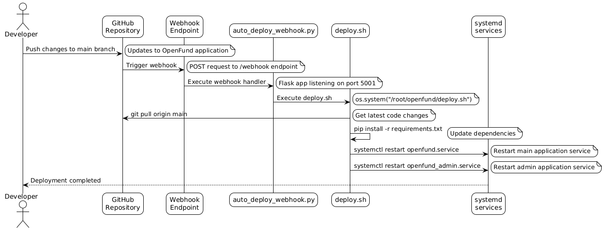

# OpenFund - Decentralized Fundraising Platform

🌐 **Live Platform**: [https://openfund.live](https://openfund.live)

OpenFund is a decentralized fundraising platform built on the Sei blockchain that enables project creators to raise funds through token sales while providing investors with a secure investment environment.

## 🌟 Key Features

### For Project Creators (Raisers)
- **Token Sale Creation**: Launch fundraising campaigns with custom ERC-20 tokens
- **Project Management**: Full control over project details, descriptions, and social links
- **Automated Lifecycle**: Smart contract-managed funding periods and status transitions
- **Real-time Analytics**: Track funding progress, investor participation, and token distribution

### For Investors
- **Secure Investment**: Protected by smart contracts with voting mechanisms
- **Refund Protection**: Fund recovery if majority voting refund
- **Portfolio Tracking**: Monitor all investments and transaction history

### Platform Features
- **Wallet Integration**: Support for MetaMask, Coinbase Wallet, Trust Wallet, and more
- **Admin Dashboard**: Comprehensive project review and content management system
- **Blog System**: Educational content and platform updates
- **Automated Deployment**: Automated pipeline for updates
- **Transaction Monitoring**: Real-time blockchain event tracking

## 📊 System Architecture


The platform consists of several interconnected components:

### Frontend (Web Application)
- **Flask Web Server**: Python-based backend serving HTML templates
- **Responsive UI**: Modern, mobile-friendly interface
- **Web3 Integration**: JavaScript libraries for blockchain interaction
- **Real-time Updates**: Dynamic content loading and status updates

### Backend Services
- **Main Application** (`app.py`): Core platform functionality
- **Admin Panel** (`openfund_admin/app.py`): Project review and content management
- **Transaction Scanner** (`scanner_transaction_cronjob.py`): Blockchain event monitoring
- **Project Updater** (`update_project_cronjob.py`): Automated status management
- **Auto-deployment** (`auto_deploy_webhook.py`): CI/CD webhook handler

### Database Layer
- **PostgreSQL**: Data storage for users, projects, and transactions

### Blockchain Layer
- **Sei Network**: EVM-compatible blockchain for smart contract deployment
- **Smart Contracts**: Solidity contracts managing fundraising logic

## 🔧 Smart Contracts

### OpenFund.sol
The main contract handling all fundraising operations:

```solidity
// Key features:
- Project creation and management
- Investment processing with USDT
- Voting mechanism for refunds
- Automated status transitions
- Platform fee collection
```

## 🔄 Project Lifecycle


### 1. Project Submission
- Raiser creates project with token details
- Platform admin reviews submission
- Project approval/rejection with feedback

### 2. Fundraising Period
- Smart contract deployment
- Investment collection in USDT
- Real-time progress tracking
- Minimum funding threshold enforcement

### 3. Voting Period (if applicable)
- Community voting on project continuation
- Refund mechanism activation
- Transparent decision process

### 4. Completion
- Successful projects receive funds (minus platform fee)
- Token distribution to investors
- Unsold token return to creator

## 🔐 Authentication System


### Wallet-Based Authentication
- **MetaMask Integration**: Primary wallet connection method
- **Message Signing**: Cryptographic proof of wallet ownership
- **Session Management**: Secure user session handling
- **Multi-wallet Support**: Various wallet providers supported

### User Types
1. **Investors**: Wallet-only authentication
2. **Raisers**: Email/password + wallet verification
3. **Admins**: username + password in admin page

## 🚀 Deployment Process



### Automated CI/CD Pipeline
1. **Git Push**: Code changes pushed to repository
2. **Webhook Trigger**: GitHub webhook activates deployment
3. **Service Restart**: Automated service restart with new code

## 📈 System Flow


### Investment Flow
1. Investor connects wallet
2. Selects project and investment amount
3. Approves USDT spending
4. Transaction processed on blockchain
5. Tokens allocated to investor
6. Database updated with transaction record

### Project Creation Flow
1. Raiser registers account
2. Submits project details
3. Admin reviews and approves
4. Smart contract deployed
5. Fundraising period begins
6. Automated status management

## 🛠 Installation & Setup

### Prerequisites
- Python 3.8+
- PostgreSQL database
- Node.js (for smart contract development)
- Hardhat framework

### Backend Setup
```bash
# Clone repository
git clone <repository-url>
cd OpenFund

# Install Python dependencies
pip install -r requirements.txt

# Configure environment variables
nano config.env

# Set up database
psql -U postgres -d your_database -f postgre/create_tables.sql

# Run main application
python app.py

# Run admin panel (separate terminal)
cd openfund_admin
python app.py
```

### Smart Contract Setup
```bash
cd contracts/test
npm install
npx hardhat compile
npx hardhat test
```

### Environment Configuration
```env
# Database
DB_HOST=localhost
DB_PORT=5432
DB_NAME=openfund
DB_USER=your_username
DB_PASSWORD=your_password

# Blockchain
RPC_URL=https://evm-rpc-arctic-1.sei-apis.com
OPENFUND_PRIVATEKEY=your_private_key
RELAYER_PRIVATE_KEY=your_relayer_key
```

## 🔧 Background Services

### Transaction Scanner
Monitors blockchain events and updates database:
```bash
python scanner_transaction_cronjob.py
```

### Project Status Updater
Manages automated project lifecycle transitions:
```bash
python update_project_cronjob.py
```

### Project Creation Service
Deploys approved projects to blockchain:
```bash
python create_project_onchain.py
```

## 📊 Database Schema

### Core Tables
- **raiser**: Project creators with authentication
- **investor**: Wallet-based investor profiles
- **project**: Fundraising project details
- **transaction**: Investment and voting records
- **project_like**: User engagement tracking
- **post**: Blog content management

### Key Relationships
- Projects belong to raisers
- Transactions link investors to projects
- Voting records track community decisions

## 🌐 API Endpoints

## 🔒 Security Features

### Smart Contract Security
- **ReentrancyGuard**: Protection against reentrancy attacks
- **Access Control**: Role-based permissions
- **Input Validation**: Comprehensive parameter checking

### Web Application Security
- **Input Sanitization**: SQL injection and XSS protection
- **Secure Sessions**: Encrypted session management
- **Rate Limiting**: API abuse prevention

## 🔮 Roadmap

### Phase 1 (Current)
- ✅ Core fundraising platform
- ✅ Smart contract deployment
- ✅ Basic admin functionality
- ✅ Gasless transactions

### Phase 2 (Upcoming)
- 🔄 Multi-chain support
- 🔄 NFT integration for user types

### Phase 3 (Future)
- 📋 DAO governance
- 📋 Staking mechanisms